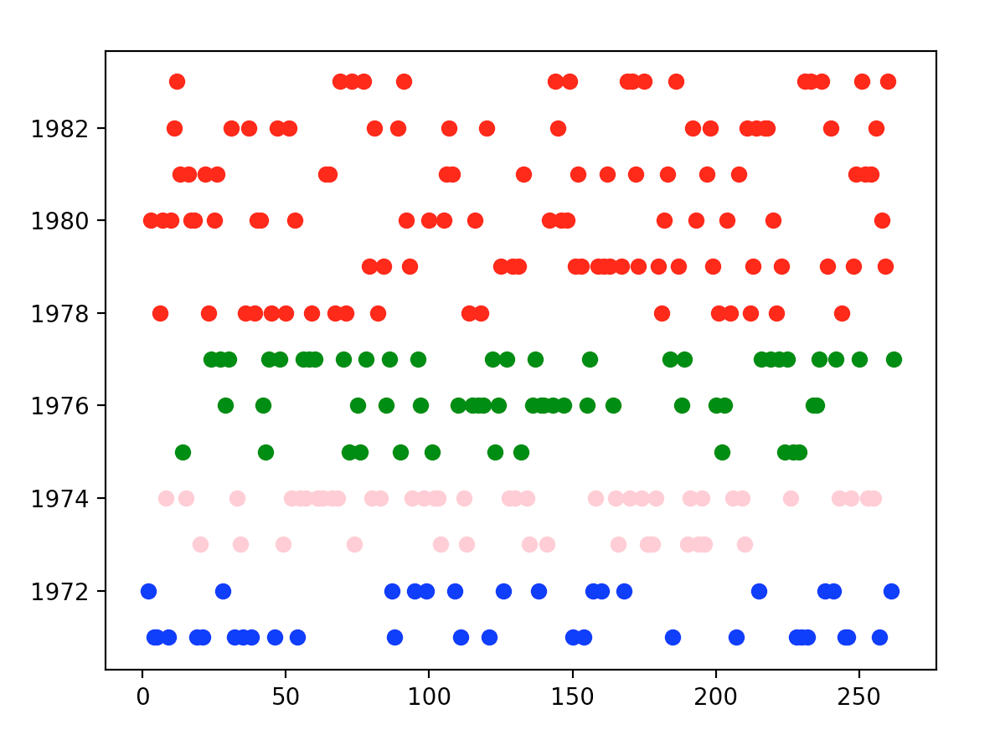

# Clustering 

implementation of K-mean and fuzzy c-mean clustering.  
for k-mean I first implemented the clustering based on year or other single features and then based on all of them (you can see a visualization of the clustering based on the year the car was made bellow), cost function is also ploted and inner and outer distance is also calculated. just for the comparison k-mean clustering is done using sklearn as well.  

 

the link for the formula behind fuzzy c-mean clustering is available in the file itself. 

 
enter `python3 clustering.py` to run this program 